<h1 align="center">Hi 👋, I'm Dương Minh Đức</h1>
<h3 align="center">A passionate developer from Viet Nam</h3>

  

- 🔭 Software Engineering Student from **Vietnam**.
- 💻 I'm currently working primarily with **Reactive Programming (Rx.NET)**, **Functional Programming (FP)**, and **Clean Architecture**.
- 👨‍💻 All of my projects are available at **https://github.com/d3nhatv0lam**

---

### Tech Stack

  
    
  
   
  

---

